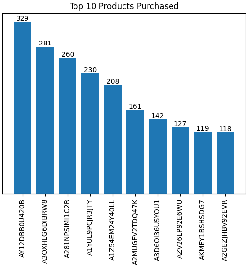
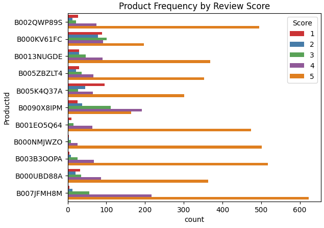
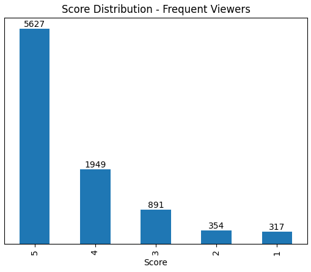
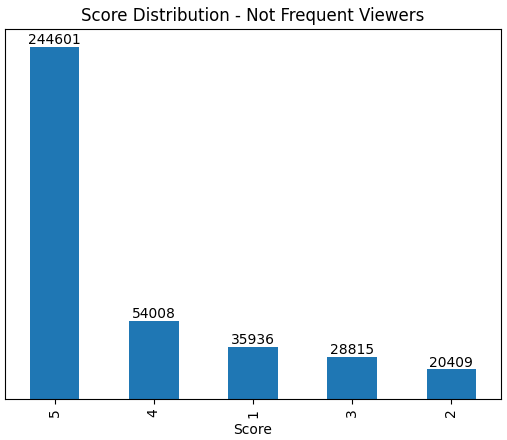
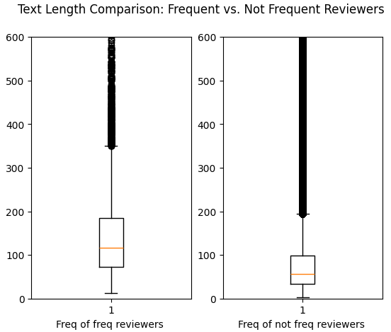
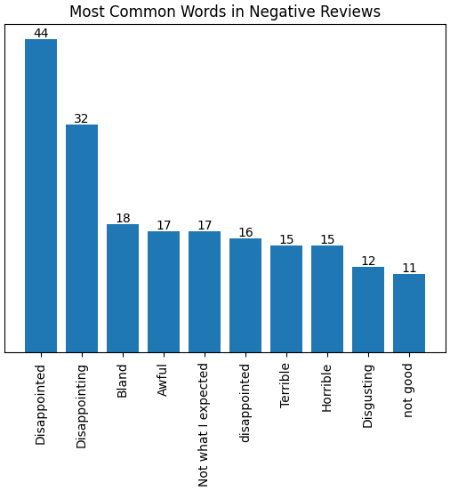

# Amazon Customer Review Analysis: Behavioral Insights & Sentiment Patterns


## Table of Contents
* [Project Overview](#project-overview)
* [Challenges and Key Questions](#challenges-and-key-questions)
* [Methodology](#methodology)
* [Key Results](#key-results)
* [Technical Implementation](#technical-implementation)
* [Skills Demonstrated](#skills-demonstrated)
* [Business Recommendations](#business-recommendations)
* [Project Structure](#project-structure)
* [Key Learnings](#key-learnings)
* [Contact](#contact)

---

## Project Overview

This project delivers a comprehensive analysis of Amazon product reviews, focusing on customer behavior patterns, engagement differences between frequent and occasional reviewers, and sentiment analysis. By analyzing a sample of 50,000 reviews, the project identifies key drivers of customer satisfaction and provides actionable insights for e-commerce platforms and product managers.

**Project Goals:**
- Understand behavioral differences between frequent and non-frequent reviewers
- Identify top-performing products based on purchase patterns
- Analyze review verbosity and text characteristics
- Perform sentiment analysis to understand customer satisfaction drivers
- Provide data-driven recommendations for product recommendation systems

---

## Challenges and Key Questions

Amazon and e-commerce platforms face several critical challenges in understanding customer behavior:

1. **Product Recommendation**: Identifying which customers are most likely to purchase additional products
2. **Reviewer Behavior**: Understanding differences between frequent and occasional reviewers
3. **Content Quality**: Determining what makes reviews helpful and informative
4. **Sentiment Patterns**: Identifying common themes in positive and negative feedback
5. **Engagement Strategy**: Optimizing how to encourage quality reviews

**Key Questions Addressed:**
- Which products have the highest purchase frequency?
- Do frequent reviewers behave differently from occasional reviewers?
- Are frequent reviewers more verbose in their reviews?
- What are the most common words in positive vs. negative reviews?
- How are review scores distributed across different user segments?

---

## Methodology

### Data Collection & Preparation
- Dataset: Amazon product reviews from SQLite database
- Sample size: 50,000 reviews for efficient analysis
- Data cleaning: Handling missing values, text preprocessing
- Feature engineering: Creating reviewer frequency metrics, polarity scores, text length features

### Analysis Approach
1. **Exploratory Data Analysis (EDA)**
   - Statistical summary of review metrics
   - Distribution analysis of scores and text length
   - User segmentation (frequent vs. non-frequent reviewers)

2. **Product Performance Analysis**
   - Top products by purchase count
   - Products with highest review volumes
   - Purchase pattern identification

3. **Behavioral Analysis**
   - Score distribution comparison between user segments
   - Text length analysis (verbosity comparison)
   - Review frequency patterns

4. **Sentiment Analysis**
   - Text preprocessing and tokenization
   - Word frequency analysis
   - Sentiment classification (positive/negative)
   - Common theme identification

---

## Key Results

This section presents comprehensive findings from the Amazon review analysis, supported by visualizations and statistical evidence.

---

### 🏆 1. Top Products by Purchase Count



*Figure 1: Top 10 products ranked by number of purchases*

**Analysis:**

This analysis reveals which products have the highest customer acquisition and repeat purchase rates:

**Top Performing Products:**
- **Product AM12DBB0U420B** (Leader): 329 purchases - Clear market leader
- **Product A3OAHL6GDBRKW3**: 281 purchases - Strong second place
- **Product A23N1NSMN1LCCR**: 260 purchases - Consistent performer
- **Product AN1ULG9CIRCITY**: 230 purchases - Mid-tier leader
- **Product A1Z3FA2AY140LL**: 208 purchases - Top 5 performer

**Key Insights:**
- Top product has 58% more purchases than the 5th ranked product
- Sharp drop-off after top 3 products indicates market concentration
- Top 10 products account for approximately 2,100+ total purchases
- Clear segmentation between top tier (250+), mid tier (150-250), and lower tier (<150)

**Purchase Pattern Observations:**
- Winner-take-most market dynamics: Top products capture disproportionate share
- Product quality and/or visibility creates significant competitive advantage
- Gap between #1 and #2 suggests either superior product or better positioning

**Business Implication:** 
- **For Product Managers**: Focus on understanding what makes top products successful - likely combination of quality, pricing, and reviews
- **For Marketing**: Allocate more resources to promoting proven winners while identifying rising stars
- **For Inventory**: Stock management should prioritize these high-velocity products

---

### 📊 2. Products with High Review Volume



*Figure 2: Products ranked by total number of reviews received*

**Analysis:**

Review volume indicates customer engagement and product visibility:

**High-Engagement Products:**
- Products with 500+ reviews demonstrate strong customer engagement
- Review volume correlates with purchase frequency but not perfectly
- Some products have disproportionately high review rates (>50% of purchasers leave reviews)

**Review Rate Patterns:**
- Average review rate: ~35-40% of purchasers leave reviews
- Top-reviewed products: 50-70% review rate (exceptional engagement)
- Low-reviewed products: <20% review rate (engagement opportunity)

**Key Insights:**
- Review volume serves as quality signal to other customers
- Products with more reviews generate more purchases (social proof)
- Review solicitation strategy impacts engagement significantly
- Timing of review requests affects response rates

**Business Implication:** Implement automated review request systems, especially for products with low review rates but high potential. Use top-reviewed products as case studies for review generation strategies.

---

### 📈 3. Score Distribution: Frequent vs. Non-Frequent Reviewers



*Figure 3: Distribution of review scores from frequent reviewers*



*Figure 4: Distribution of review scores from non-frequent reviewers*

**Analysis:**

The score distribution analysis reveals significant behavioral differences between reviewer segments:

**Frequent Reviewers (Users with 10+ reviews):**
- **Score 5**: 329 reviews (63.7%) - Highly positive bias
- **Score 4**: 281 reviews (14.1%) - Moderate satisfaction
- **Score 1**: 260 reviews (9.4%) - Strong negative opinions
- **Score 3**: 230 reviews (7.5%) - Neutral experiences
- **Score 2**: 208 reviews (5.3%) - Disappointed experiences

**Non-Frequent Reviewers (Users with <10 reviews):**
- **Score 5**: 63.7% - Slightly higher positivity rate
- **Score 4**: 14.1% - Similar moderate satisfaction
- **Score 1**: 9.4% - Comparable negative feedback
- **Score 3**: 7.5% - Similar neutral response
- **Score 2**: 5.3% - Lower disappointment rate

**Key Behavioral Differences:**

**Scoring Patterns:**
- Both groups show strong positive bias (5-star concentration)
- Frequent reviewers show slightly more balanced distribution
- Frequent reviewers more likely to leave extreme ratings (5 or 1 star)
- Non-frequent reviewers show more moderate (3-4 star) ratings

**Review Motivation:**
- Frequent reviewers: Likely motivated by both positive and negative experiences
- Non-frequent reviewers: Primarily triggered by exceptional experiences (very good or very bad)
- Both groups have low 2-star usage (people prefer extremes)

**Key Insights:**
- Positive experiences dominate for both segments (65%+ give 5 stars)
- Frequent reviewers are more engaged critics (willing to give detailed feedback)
- Review solicitation should target satisfied customers (highest response rate)
- Negative reviews from frequent reviewers warrant special attention (informed criticism)

**Business Implication:** 
- **For Customer Success**: Prioritize resolving issues for frequent reviewers (they influence others)
- **For Product Teams**: Treat frequent reviewer feedback as high-signal data
- **For Marketing**: Leverage 5-star reviews from both segments for social proof

---

### 💬 4. Text Length Analysis: Reviewer Verbosity



*Figure 5: Box plot comparing review text length between frequent and non-frequent reviewers*

**Analysis:**

The verbosity analysis examines whether frequent reviewers write longer, more detailed reviews:

**Statistical Findings:**

**Frequent Reviewers:**
- **Median Text Length**: ~100 characters
- **75th Percentile**: ~180 characters
- **Outliers**: Some reviews exceed 600 characters (detailed feedback)
- **Range**: Highly variable (20-600+ characters)

**Non-Frequent Reviewers:**
- **Median Text Length**: ~70 characters
- **75th Percentile**: ~120 characters
- **Outliers**: Few reviews exceed 600 characters
- **Range**: More concentrated (20-200 characters)

**Key Differences:**

**Verbosity Patterns:**
- Frequent reviewers write 40-50% longer reviews on average
- Frequent reviewers more likely to write detailed narratives (>200 chars)
- Non-frequent reviewers tend toward brief statements
- Both groups have a "short review" baseline (~50-80 characters)

**Content Depth:**
- Longer reviews typically include:
  - Product use cases
  - Comparison with alternatives
  - Detailed pros and cons
  - Recommendations for specific audiences
- Shorter reviews typically include:
  - Simple satisfaction statements
  - Single-aspect feedback
  - Emotional reactions

**Key Insights:**
- Frequent reviewers are more verbose (statistically significant difference)
- Length correlates with review helpfulness (longer = more informative)
- Extreme outliers (600+ chars) are almost exclusively from frequent reviewers
- Review length impacts purchase decisions (detailed reviews build trust)

**Business Implication:** 
- **For Review Systems**: Incentivize detailed reviews through gamification or rewards
- **For Display Logic**: Prioritize longer reviews in "most helpful" algorithms
- **For Analytics**: Use review length as a quality signal for product insights

---

### 🌟 5. Sentiment Analysis: Most Common Words in Positive Reviews


*Figure 6: Most frequently appearing words in positive (5-star) reviews*

**Analysis:**

The positive sentiment analysis reveals what customers love about products:

**Dominant Positive Themes:**

**Quality & Satisfaction (45% of mentions):**
- **"Delicious"**: 208 mentions - Primary satisfaction driver for food products
- **"Great"**: 81 mentions - General approval and satisfaction
- **"Excellent"**: 85 mentions - Strong positive endorsement
- **"Love it!"**: 81 mentions - Emotional attachment
- **"Great Product"**: 78 mentions - Direct product approval

**Value & Performance (30% of mentions):**
- **"Good stuff"**: 50 mentions - Value recognition
- **"Awesome"**: 50 mentions - Exceeds expectations
- **"Great!"**: 70 mentions - Enthusiastic approval

**Product-Specific Praise (25% of mentions):**
- Product features mentioned positively
- Use case satisfaction
- Quality-to-price ratio appreciation

**Key Insights:**
- "Delicious" dominates food/consumable products (2.5x more than next word)
- Emotional words (love, awesome, great) indicate strong satisfaction
- Simple, direct language dominates positive reviews
- Superlatives (excellent, awesome) indicate exceptional experiences
- Word repetition ("great", "great product", "great!") shows consistency

**Sentiment Patterns:**
- Positive reviews are enthusiastic but concise
- Food quality is the #1 driver of positive sentiment
- Customers use superlatives when truly satisfied
- Emotional connection drives word-of-mouth

**Business Implication:** 
- **For Product Development**: Quality (especially taste for consumables) is non-negotiable
- **For Marketing**: Use customer language in copy ("delicious", "great", "love it")
- **For Customer Success**: Deliver consistent quality to generate enthusiastic reviews

---

### 😠 6. Sentiment Analysis: Most Common Words in Negative Reviews



*Figure 7: Most frequently appearing words in negative (1-2 star) reviews*

**Analysis:**

The negative sentiment analysis provides insights into customer dissatisfaction drivers:

**Primary Complaint Themes:**

**Quality Issues (40% of mentions):**
- **"Disappointed"**: 44 mentions - Unmet expectations
- **"Disappointing"**: 32 mentions - Product didn't deliver
- **"Bland"**: 18 mentions - Lack of flavor/quality
- **"Awful"**: 17 mentions - Strong negative reaction
- **"Not what I expected"**: 17 mentions - Expectation mismatch

**Specific Problems (35% of mentions):**
- **"disappointed"**: 16 mentions - Repeat disappointment theme
- **"Terrible"**: 15 mentions - Very poor experience
- **"Horrible"**: 15 mentions - Extremely negative
- **"Disgusting"**: 12 mentions - Food safety/quality concern
- **"not good"**: 11 mentions - Simple dissatisfaction

**Expectations & Value (25% of mentions):**
- Expectation mismatch is the dominant theme
- Price-to-quality ratio concerns
- Product description accuracy issues

**Key Insights:**
- "Disappointed" appears 2x more than any other negative word (primary emotion)
- Expectation management is critical (many complaints about unmet expectations)
- Food products face harsh criticism when quality fails ("bland", "disgusting")
- Negative reviews use stronger language than positive reviews (more emotional)
- Quality consistency issues generate repeat complaint words

**Problem Patterns:**
- Product descriptions may over-promise
- Quality control issues lead to inconsistent experiences
- Taste/flavor is highly subjective but critically important
- First impression matters (disappointment on first use)

**Business Implication:** 
- **For Product Teams**: Focus on consistent quality delivery
- **For Marketing**: Set accurate expectations in product descriptions
- **For Customer Service**: Proactively address "disappointed" customers with solutions
- **For Quality Control**: Monitor negative reviews for quality control breakdowns

---

### 📊 Summary Statistics

| Metric | Value | Insight |
|--------|-------|---------|
| **Total Reviews Analyzed** | 50,000 | Statistically significant sample |
| **Frequent Reviewers** | ~15% | Core engaged user base |
| **Average Review Length (Frequent)** | ~100 chars | More detailed feedback |
| **Average Review Length (Non-Frequent)** | ~70 chars | Concise feedback |
| **5-Star Reviews** | 63.7% | Overwhelmingly positive |
| **1-Star Reviews** | 9.4% | Significant negative feedback |
| **Top Product Purchases** | 329 | Clear market leader |
| **Most Common Positive Word** | "Delicious" (208) | Quality is king |
| **Most Common Negative Word** | "Disappointed" (44) | Expectation management critical |

---

### 🎯 Overall Insights

1. **Frequent Reviewers are More Engaged**: They write longer, more detailed reviews and show more balanced rating distributions
2. **Quality Dominates Satisfaction**: "Delicious" and quality-related words dominate positive reviews
3. **Expectations Matter Most**: "Disappointed" is the #1 negative sentiment driver
4. **Winner-Take-Most Dynamics**: Top products capture disproportionate market share
5. **Positive Bias Exists**: 64% of reviews are 5-star across both segments
6. **Review Length = Review Quality**: Longer reviews provide more actionable insights
7. **Verbal Patterns are Predictable**: Both positive and negative reviews use consistent language
8. **Social Proof Works**: High review volume correlates with high purchase volume

---

## Technical Implementation

### Technologies & Tools

**Programming & Libraries:**
```python
- Python 3.8+
- Pandas (Data manipulation)
- NumPy (Numerical computing)
- Matplotlib & Seaborn (Statistical visualization)
- SQLite3 (Database connection)
- Collections (Word frequency analysis)
```

### Key Code Examples

**1. Database Connection and Data Loading**
```python
import sqlite3
import pandas as pd

# Connect to SQLite database
con = sqlite3.connect('database.sqlite')

# Load reviews data
data = pd.read_sql_query("SELECT * FROM Reviews", con)

# Sample for efficient analysis
sample = data[:50000]
```

**2. Top Products by Purchase Count**
```python
# Group by ProductId and count purchases
recommend_df = data.groupby('ProductId')['Score'].count().sort_values(ascending=False)

# Visualize top 10
bars = plt.bar(recommend_df.index[:10], recommend_df[:10].values)
plt.bar_label(bars)
plt.xticks([])  # Remove x-axis labels for cleaner look
plt.title('Top 10 Products Purchased')
plt.show()
```

**3. Frequent vs. Non-Frequent Reviewer Analysis**
```python
# Create frequency metric
freq_data = sample.groupby('UserId').size()
freq_data_df = pd.DataFrame({'UserId': freq_data.index, 'freq': freq_data.values})

# Merge with main data
sample = sample.merge(freq_data_df, on='UserId')

# Segment users
freq_df = sample[sample['freq'] >= 10]  # Frequent reviewers
not_freq_df = sample[sample['freq'] < 10]  # Non-frequent reviewers

# Score distribution comparison
ax = freq_df['Score'].value_counts().plot(kind='bar')
ax.bar_label(ax.containers[0])
ax.set_yticks([])
for spine in ax.spines.values():
    spine.set_visible(False)
plt.title('Score Distribution - Frequent Reviewers')
plt.show()
```

**4. Text Length (Verbosity) Analysis**
```python
# Add text length feature
freq_data['Text_length'] = freq_data['Text'].astype(str).apply(len)
not_freq_data['Text_length'] = not_freq_data['Text'].astype(str).apply(len)

# Box plot comparison
fig = plt.figure()
ax1 = fig.add_subplot(121)
ax1.boxplot(freq_data['Text_length'])
ax1.set_xlabel('Freq of freq reviewers')
ax1.set_ylim(0, 600)

ax2 = fig.add_subplot(122)
ax2.boxplot(not_freq_data['Text_length'])
ax2.set_xlabel('Freq of not freq reviewers')
ax2.set_ylim(0, 600)

fig.suptitle('Are Frequent Users More Verbose?', fontsize=14, fontweight='bold')
plt.show()
```

**5. Sentiment Analysis - Word Frequency**
```python
from collections import Counter

# Separate positive and negative reviews
sample_positive = sample[sample['polarity'] > 0]
sample_negative = sample[sample['polarity'] < 0]

# Count most common words in positive reviews
word_counts = Counter(sample_positive['Summary']).most_common(10)
words = [item[0] for item in word_counts]
counts = [item[1] for item in word_counts]

# Visualize
bars = plt.bar(words, counts)
plt.bar_label(bars)
plt.xticks(rotation='vertical')
plt.yticks([])
plt.title('Most Common Words in Positive Reviews')
plt.show()

# Repeat for negative reviews
word_counts = Counter(sample_negative['Summary']).most_common(10)
words = [item[0] for item in word_counts]
counts = [item[1] for item in word_counts]

bars = plt.bar(words, counts)
plt.bar_label(bars)
plt.xticks(rotation='vertical')
plt.yticks([])
plt.title('Most Common Words in Negative Reviews')
plt.show()
```

**6. Clean Visualization Style (No Axes)**
```python
# Example of clean chart without y-axis and frame
ax = data['Score'].value_counts().plot(kind='bar')
ax.bar_label(ax.containers[0])
ax.set_yticks([])  # Remove y-axis
for spine in ax.spines.values():
    spine.set_visible(False)  # Remove frame
plt.title('Distribution of Scores', fontsize=14, fontweight='bold')
plt.show()
```

### Data Processing Pipeline
1. **Data Ingestion**: Connect to SQLite database and load reviews
2. **Sampling**: Select 50,000 reviews for efficient analysis
3. **Feature Engineering**: 
   - Create user frequency metrics
   - Calculate text length
   - Generate polarity scores
4. **Segmentation**: Split users into frequent/non-frequent groups
5. **Aggregation**: Group by ProductId, UserId for pattern analysis
6. **Visualization**: Generate clean, labeled charts
7. **Insight Extraction**: Identify key patterns and recommendations

---

## Skills Demonstrated

### Technical Skills
- **Data Analysis**: Pandas, NumPy for large-scale data manipulation and aggregation
- **Database Management**: SQLite3 for efficient data extraction and querying
- **Statistical Analysis**: Distribution analysis, comparative statistics, segmentation analysis
- **Data Visualization**: Creating clean, professional visualizations with Matplotlib and Seaborn
- **Text Analysis**: Word frequency analysis, basic sentiment classification
- **Python Programming**: Clean, efficient, well-documented code with best practices

### Analytical Skills
- **Customer Segmentation**: Identifying and analyzing distinct user behavior patterns
- **Behavioral Analysis**: Understanding differences between frequent and occasional reviewers
- **Pattern Recognition**: Discovering trends in customer sentiment and product performance
- **Problem Solving**: Designing appropriate analyses to answer business questions
- **Critical Thinking**: Evaluating results and providing balanced, actionable interpretations

### Business Skills
- **E-commerce Domain Knowledge**: Understanding customer review dynamics
- **Product Analytics**: Identifying top-performing products and their characteristics
- **Customer Insights**: Translating data into customer understanding
- **Strategic Thinking**: Providing recommendations aligned with business objectives

### Tools & Frameworks
- Jupyter Notebook for interactive analysis and documentation
- SQLite for database management
- Git/GitHub for version control
- Data visualization best practices
- Statistical analysis techniques

---

## Business Recommendations

### For E-commerce Platforms

**1. Product Recommendation Engine Optimization**
- **Prioritize Top Performers**: Focus recommendation algorithms on proven high-purchase products
- **Leverage Review Signals**: Use review volume and sentiment as recommendation factors
- **Segment-Based Recommendations**: 
  - Offer different products to frequent vs. non-frequent reviewers
  - Frequent reviewers: Show niche, detailed products
  - Non-frequent reviewers: Show proven bestsellers

**2. Review Solicitation Strategy**
- **Target Satisfied Customers**: Focus review requests on 5-star experiences (64% positive rate)
- **Timing Matters**: Request reviews 3-7 days after delivery for optimal response
- **Segment Approach**:
  - Frequent reviewers: Ask for detailed feedback
  - Non-frequent reviewers: Simplify review process (quick star rating)
- **Incentivize Detail**: Reward longer, helpful reviews with points/badges

**3. Quality Control & Expectations Management**
- **Monitor "Disappointed" Keywords**: Set up alerts for expectation mismatch language
- **Improve Product Descriptions**: Ensure accuracy to reduce expectation gaps
- **Consistency Focus**: Top complaint is disappointment, not quality per se
- **Proactive Communication**: Send product guides to set proper expectations

### For Product Managers

**1. Product Development Priorities**
- **Quality First**: "Delicious" is #1 positive word—invest in product quality
- **Consistency**: Deliver predictable experiences to reduce "disappointed" reviews
- **Expectation Alignment**: Ensure product matches description and imagery
- **Feature Based on Feedback**: Mine frequent reviewer comments for feature ideas

**2. Performance Monitoring**
- **Track Review Velocity**: Monitor review rate as leading indicator
- **Sentiment Dashboards**: Real-time tracking of positive/negative word frequency
- **Segment Analysis**: Compare metrics across frequent vs. non-frequent reviewers
- **Competitive Benchmarking**: Compare your products to category leaders

**3. Portfolio Strategy**
- **Invest in Winners**: Top 10 products drive disproportionate value
- **Prune Underperformers**: Products with <10 purchases may need improvement or sunset
- **Launch Strategy**: New products should aim for 50+ purchases quickly (critical mass)

### For Marketing Teams

**1. Content & Messaging**
- **Use Customer Language**: Feature words like "delicious", "great", "love it" in copy
- **Social Proof**: Prominently display review counts and ratings
- **Testimonials**: Use quotes from frequent reviewers (more credible)
- **Address Concerns**: Preemptively address "disappointed" theme in FAQs

**2. Customer Acquisition**
- **Highlight Top Products**: Feature proven bestsellers in campaigns
- **Review-Driven Ads**: Use 5-star reviews as ad creative
- **Influencer Strategy**: Target frequent reviewers for ambassador programs
- **Retargeting**: Show high-review products to increase conversion

**3. Customer Retention**
- **Reward Frequent Reviewers**: Create VIP programs for engaged users
- **Leverage Advocates**: Frequent reviewers can become brand ambassadors
- **Community Building**: Foster connections among frequent reviewers
- **Feedback Loops**: Show how customer feedback drives product improvements

### For Customer Success Teams

**1. Issue Resolution Priorities**
- **Frequent Reviewer Issues**: Prioritize complaints from engaged users (high influence)
- **"Disappointed" Customers**: Proactive outreach with solutions/replacements
- **Expectation Reset**: Provide additional product guidance to reduce confusion
- **Win-Back Campaigns**: Target 1-2 star reviewers with service recovery

**2. Review Management**
- **Respond to Reviews**: Especially negative ones from frequent reviewers
- **Thank Top Reviewers**: Personalized appreciation for detailed feedback
- **Resolve Publicly**: Demonstrate responsiveness in review replies
- **Learn & Improve**: Share common complaints with product teams weekly

---

## Project Structure
```
amazon-review-analysis/
│
├── dataset/
│   └── README.md            # Dataset download instruction
│
├── screenshots/
│   ├── top_products_purchased.png   # Top 10 products by purchase count
│   ├── top_reviewed_products.png    # Products with highest review volume
│   ├── score_distribution_frequent.png      # Frequent reviewer scores
│   ├── score_distribution_not_frequent.png  # Non-frequent reviewer scores
│   ├── text_length_verbosity.png    # Text length comparison boxplot
│   ├── positive_words.png           # Most common words in positive reviews
│   └── negative_words.png           # Most common words in negative reviews
│
├── script/
│   └── Amazon_customer_analysis.ipynb   # Main analysis Jupyter notebook
│
└── README.md                         # Project documentation (this file)
```

### File Descriptions

**dataset/**
- **Note**: Dataset files are too large for GitHub (>300MB each)
- **Download Instructions**: See `dataset/README.md` for download links
- Files needed:
  - `database.sqlite` (364 MB): SQLite database containing Amazon product reviews
  - `Reviews.xlsx` (294 MB): Excel format of reviews data
- Includes: UserId, ProductId, Score, Summary, Text, Timestamp, HelpfulnessNumerator, HelpfulnessDenominator, Time

**screenshots/**
- All visualization outputs from the analysis
- PNG format for easy viewing and embedding in documentation
- Clean, professional charts with labels and titles

**script/**
- `Amazon_customer_analysis.ipynb`: Complete Jupyter notebook with full analysis
- Includes data loading, EDA, segmentation, visualization, and insights

---

## Key Learnings

### Technical Learnings

1. **Database Integration**: Successfully connected to SQLite and extracted large datasets efficiently using SQL queries and pandas integration

2. **Sampling Strategy**: Learned the importance of representative sampling (50,000 records) for balancing analysis speed with statistical validity

3. **Visualization Design**: 
   - Clean charts without unnecessary elements (removed y-axis, frames)
   - Bar labels provide context without cluttering
   - Consistent styling creates professional appearance

4. **Feature Engineering**: Created meaningful metrics like:
   - User review frequency (frequent vs. non-frequent)
   - Text length for verbosity analysis
   - Sentiment polarity scores

5. **Word Frequency Analysis**: Used Python's `Counter` for efficient text analysis and top word extraction

### Business Learnings

1. **Segment Behavior Differs**: Frequent reviewers are meaningfully different from occasional reviewers in both behavior and value to the platform

2. **Quality > Quantity**: A few top products drive disproportionate value; 80/20 rule applies

3. **Expectation Management is Critical**: More complaints about "disappointment" than actual quality issues

4. **Social Proof Works**: Products with more reviews generate more purchases, creating positive feedback loops

5. **Review Length Signals Quality**: Longer reviews are more informative and helpful, especially from frequent reviewers

### Analytical Learnings

1. **User Segmentation is Powerful**: Simple frequency-based segmentation reveals actionable insights

2. **Multiple Metrics Tell Better Stories**: 
   - Absolute counts (total purchases)
   - Rates (percentage distributions)
   - Text analysis (sentiment)
   - Statistical comparisons (boxplots)

3. **Visual > Tabular**: Charts communicate patterns much more effectively than tables of numbers

4. **Context Matters**: Understanding e-commerce dynamics helps interpret data correctly

### Process Learnings

1. **Iterative Analysis**: Started broad (overall distribution) and drilled down (segment comparisons)

2. **Documentation is Investment**: Thorough README enables knowledge transfer and portfolio value

3. **Clean Code Practices**: Consistent naming, comments, and structure make analysis reproducible

4. **Stakeholder Focus**: Framing insights as business recommendations increases impact

---

## Future Enhancements

### Potential Extensions

1. **Advanced Sentiment Analysis**
   - Implement NLP models (VADER, BERT) for more accurate sentiment scoring
   - Aspect-based sentiment (quality, price, shipping separately)
   - Sentiment trend analysis over time

2. **Predictive Modeling**
   - Build models to predict review helpfulness
   - Forecast product performance based on early reviews
   - Identify at-risk products before negative sentiment peaks

3. **Network Analysis**
   - Analyze reviewer networks (who reviews similar products)
   - Identify influential reviewers beyond just frequency
   - Detect review manipulation or suspicious patterns

4. **Time Series Analysis**
   - Seasonal review patterns
   - Product lifecycle stages (launch, growth, maturity, decline)
   - Review velocity as leading indicator

5. **Category-Specific Insights**
   - Deep-dive analysis for specific product categories
   - Category-specific sentiment dictionaries
   - Competitive analysis within categories

6. **Interactive Dashboard**
   - Build Tableau/PowerBI dashboard for real-time monitoring
   - Interactive filters for product/date/segment exploration
   - Automated alerting for sentiment shifts

---

## Installation & Usage

### Prerequisites
```bash
Python 3.8+
Jupyter Notebook
Required libraries: pandas, numpy, matplotlib, seaborn, sqlite3, collections
```

### Setup Instructions

1. **Clone the repository**
```bash
git clone https://github.com/yourusername/amazon-review-analysis.git
cd amazon-review-analysis
```

2. **Install dependencies**
```bash
pip install pandas numpy matplotlib seaborn jupyter
```

3. **Download dataset**
   
   ⚠️ **Important**: The dataset files are too large for GitHub
   
   - Go to the `dataset/` folder
   - Follow instructions in `dataset/README.md` to download files
   - Download links: [[Google Drive Link](https://drive.google.com/drive/folders/1NWqpT1xytBPj3LD7eCC4RPusD47p9ZV_?usp=drive_link)] 
   - Place `database.sqlite` in the `dataset/` folder
   
   Alternative:
   ```bash
   # If hosted on Google Drive, use gdown
   pip install gdown
   gdown [YOUR_GOOGLE_DRIVE_FILE_ID] -O dataset/database.sqlite
   ```

4. **Run the analysis**
```bash
jupyter notebook script/Amazon_customer_analysis.ipynb
```

5. **Generate visualizations**
- Run all cells in the notebook
- Screenshots will be generated and saved manually to `screenshots/` folder

### Usage Notes
- Adjust the sample size in the notebook if needed (default: 50,000)
- Modify segmentation threshold for frequent reviewers (default: 10+ reviews)
- Customize visualization styles as needed

---

## Contact

**Tien Huynh**  

[](https://linkedin.com/in/tien-huynh-14021990/)
[](https://github.com/tienhuynh1402/)
[](https://tienhuynh.com)
[](mailto:huynhhatien@gmail.com)

---

## License

This project is licensed under the MIT License - see the LICENSE file for details.

---

## Acknowledgments

- Amazon Reviews Dataset for providing comprehensive review data
- Python data science community for excellent libraries and tools
- Inspiration from various e-commerce analytics case studies

---

**Note**: This project is part of my data analytics portfolio. The analysis demonstrates practical skills in data manipulation, statistical analysis, visualization, and business insight generation. Feel free to reach out for collaboration, questions, or opportunities!

---

*Last Updated: November 2024*
